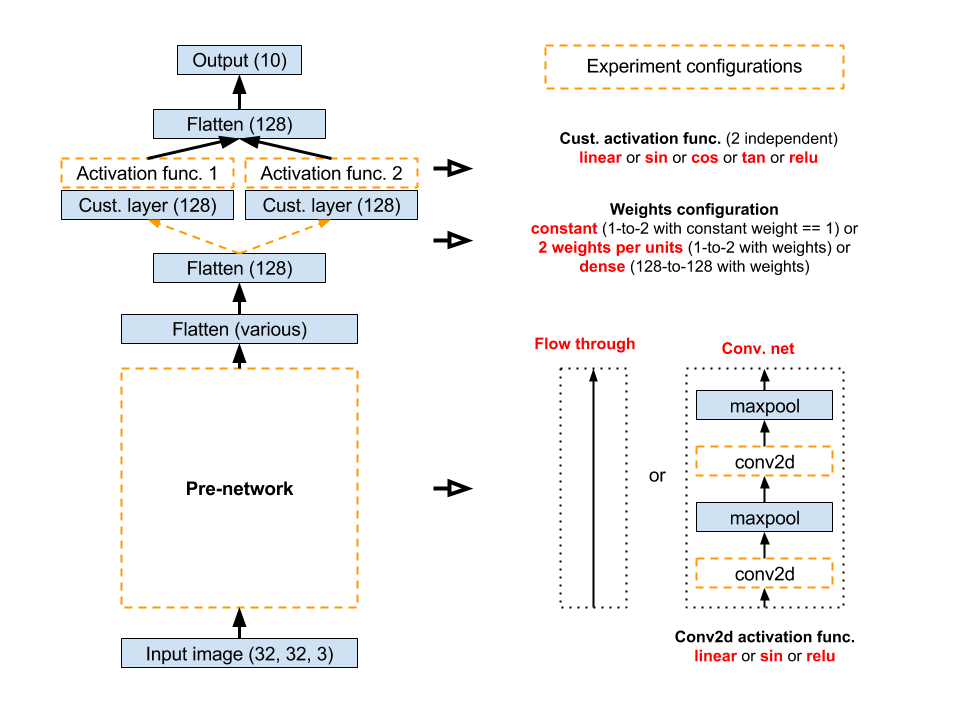
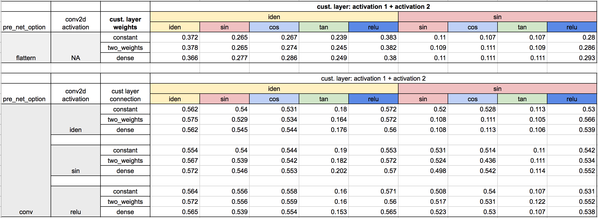
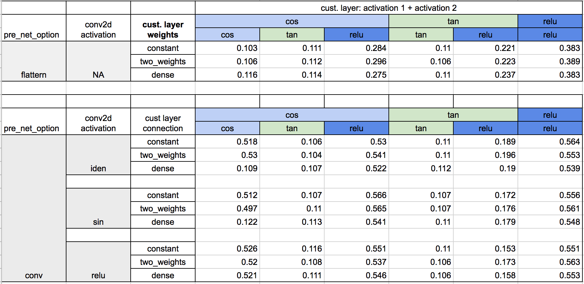
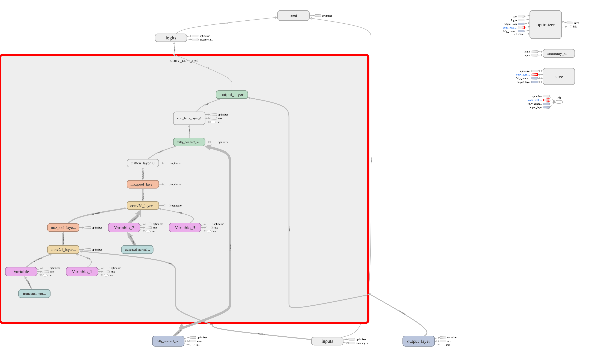
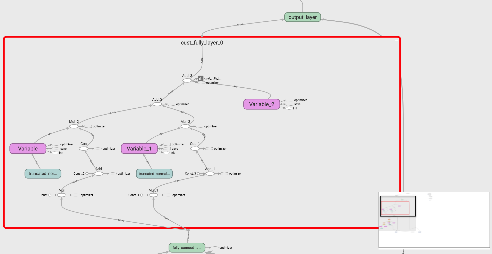
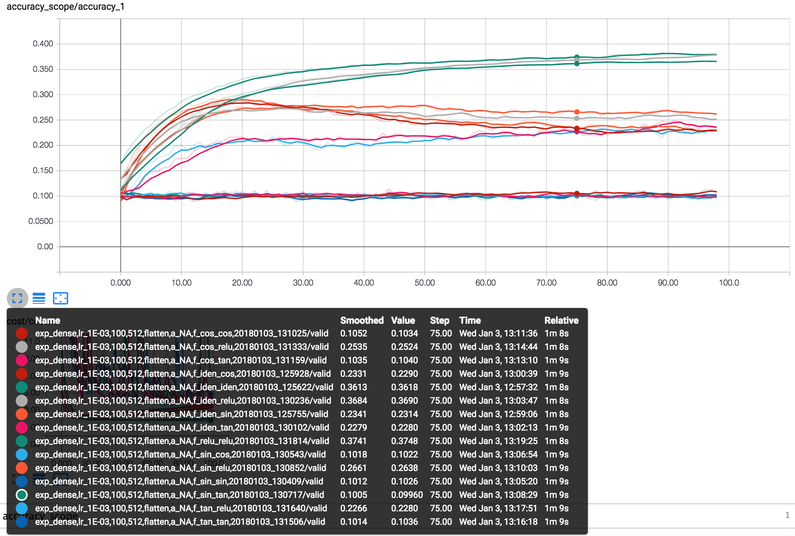
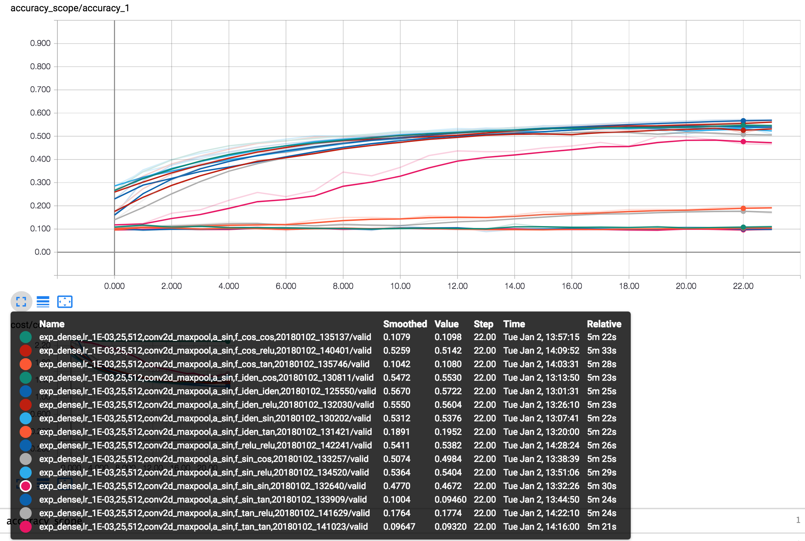
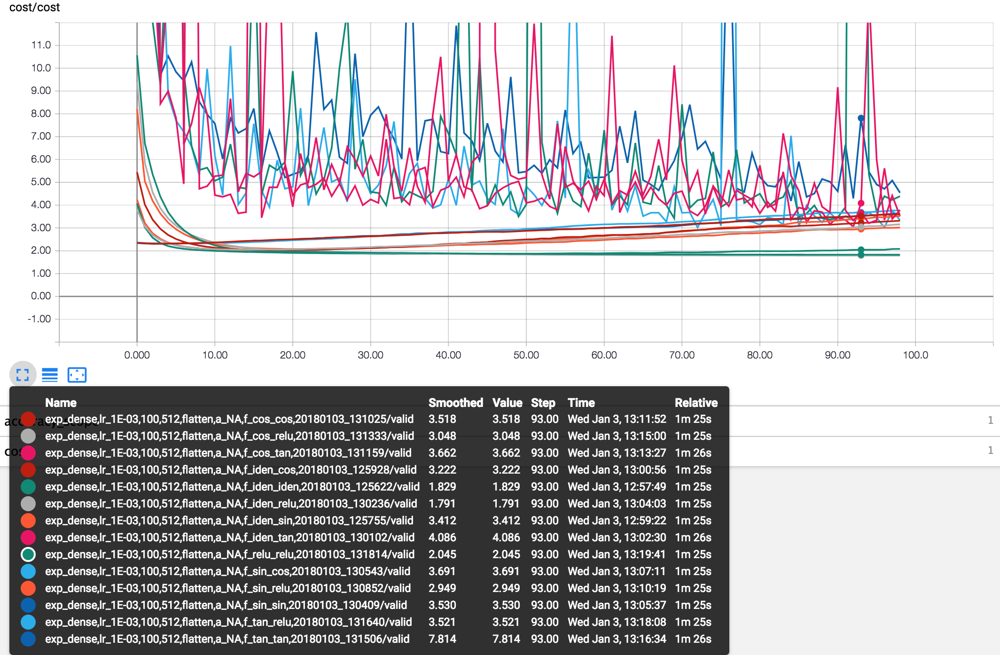
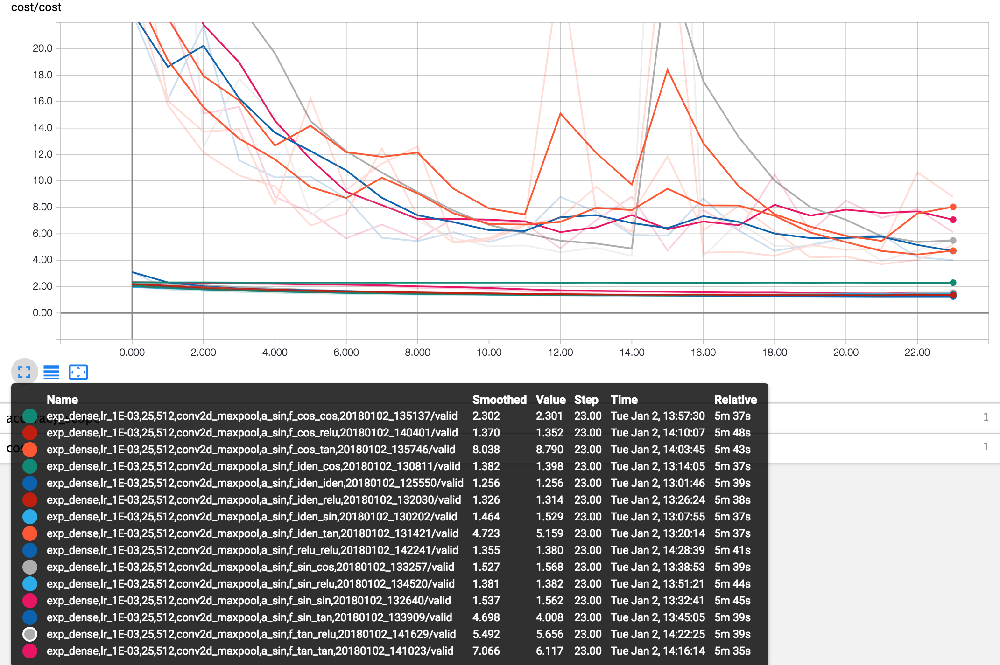

# cifar-innovation

[`TensorFlow` and `TensorBoard`] 

**ML Algorithms**  
Feedforward Neural Network and Convolutional Neural Networks  

**Envs**  
Anaconda and Python 3.6

**Envs and Packages**  
conda create -n cifar python=3
conda install numpy matplotlib scikit-learn tensorflow

**Run Steps**  
% git clone https://github.com/jasonx1011/cifar-innovation.git 
% python main.py  

**Motivation**  
Theoretically, based on [Fourier Transform](https://en.wikipedia.org/wiki/Fourier_transform), we could represent any waveform by an infinite sum of periodic sines waves and cosine waves.  

Nowadays, most neural networks use non-periodic and monotonic activation functions, i.e. relu function, across the whole architecture, but I would like to do some experiments to see if the periodic activation functions could potential help the performance or not.

**Innovation**  
Usually, people use the same monotonic activation function within the same layer.
However, based on the inspiration from Fourier Transform, I created a custom layer, which composed by two same/different kind of periodic/non-periodic activation functions units within the same layer. I put this custom layer in the middle of the FNNs network for classification task and compare it with the baseline result (baseline: all linear activation in the network).  

**Raw Data:**   
CIFAR10 image data set batch 1 (10,000 images)

**Experiment Configurations**  
   * Flowchart: 
  

[pre-network configurations]: 
   * Flowthrough
   * Convolutional net (4 layers - conv2d, maxpool, conv2d, maxpool)

[conv2d layer activation configurations]
   * [linear , sin, relu]

[custom layers connections]:
   * constant (1-to-2 with constant weight == 1)
   * 2 weights per units (1-to-2 with weights)
   * dense (128-to-128 with weights)

[custom layer activation configurations]: 
   * 15 total combinations [linear, sin, cos, tan, relu] x [linear, sin, cos, tan, relu]

**Experiment Results**  
   * Validation Accuracy in different experiment configurations: 
  
  

**Summary**  
Briefly conclusion of this experiment:
   * CNNs perform better than purely FNNs in image classification task as expected 
   * activation function usage performance: linear/relu > sin > cos >> tan  

Here are some lessons I learned or confirmed:
   * CNNs boosts the accuracy and makes network more robust, but the run time increase dramatically as expected.
      * CNNs v.s. FNNs: validation accuracy increase from 38% to 56%, but run time is about 13x
      * runtime: 1.55 mins/100 epochs without conv net, 5.18 mins/25 epochs with conv net
   * Impact of activation functions:
      * relu function generally makes the overall network performance better and more robust to the periodic activation inside the network
      * sin/cos activation function perform mixed in different setting, but generally sin function perform better than cos function 
      * tan activation funcation will make the cost curve unstable and it will also make poorly performance 
   
   * Architecture configuration (constant weights/sparse weights/dense weights):
      * periodic activation functions are easily overfitting with dense connection in purely FNNs

   * Custom design layer - multiple periodic activation function within the same layer:
      * the result did not perform better than using purely relu/linear function. 
      * validation accuracy: (iden + iden) ~= 0.57, (sin + cos) ~= 0.53, (relu + relu) ~= 0.56
      * if we use both periodic activation function for custom layer, it will be sensitive to the previous network activation function or connection configuration. (vulnerable in dense configuration which is not preferable) 

   
**Future Works**  
Although the periodic activation function is difficult to train and sensitive to the network architecture, we could see the initial training curve are faster than linear activation function in some cases. This encourages future work to investigate the use of periodic functions combining with other monotonic activation function.

**Tensorboard Samples**  
   * Conv net graph: 
  
   * Cust layer graph: 
  
   * Accuracy sample: 
  
  
   * Cost sample: 
  
  

